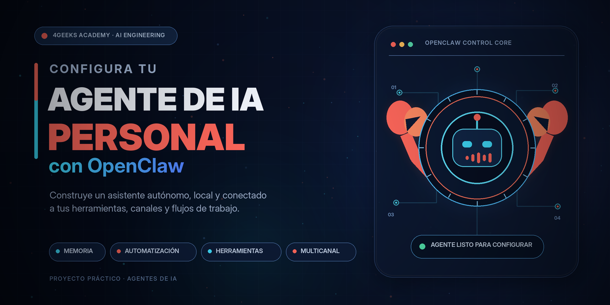

# Configurando tu Agente de IA Personal con OpenClaw

Despliegue de un agente OpenClaw en un VPS Ubuntu 22.04 LTS, conectado a un modelo
mediante el proveedor LiteLLM. Proyecto de 4Geeks Academy — AI Engineering.

## Stack

| Componente | Valor |
|---|---|
| SO | Ubuntu 22.04.5 LTS (x86_64, kernel 5.15) |
| Hardware | 1 vCPU, 957 MB RAM, 25 GB disco |
| OpenClaw | 2026.7.1-2 |
| Node.js | v24.18.0 (vía NodeSource) |
| Proveedor | LiteLLM — gateway de 4Geeks |
| Modelo | `madrid-spain/openrouter/deepseek/deepseek-v4-flash` |
| Gateway | local, bind loopback 127.0.0.1:18789, auth por token |

## Proceso

1. **Diagnóstico del VPS.** Acceso por SSH con clave ed25519. Validación de
   requisitos antes de instalar: el servidor no alcanzaba el mínimo de 2 GB de RAM.
2. **Memoria de intercambio.** Creación de 2 GB de swap persistidos en `/etc/fstab`.
   Sin esto la instalación falla por falta de memoria.
3. **Instalación.** Instalador oficial `curl -fsSL https://openclaw.ai/install.sh | bash`.
4. **Configuración.** LiteLLM como proveedor, hooks habilitados, Skills y Channel
   Workflows omitidos deliberadamente.
5. **Seguridad.** Gateway atado a loopback: no accesible desde internet. OpenClaw no
   es multi-tenant, así que exponerlo daría control total a cualquiera con la URL.
6. **Auditoría del workspace** antes del push: sin `openclaw.json`, sin `.env`,
   sin credenciales.
7. **Publicación** en GitHub mediante clave SSH generada en el propio VPS.

## Elección del modelo

Se eligió **DeepSeek V4 Flash** sobre las alternativas del gateway por coste y
latencia, no por potencia bruta: es la variante ligera (284B MoE frente a 1,6T del
V4-Pro) y responde en ~1,4 s. Para un asistente conversacional con hooks activos,
la latencia y el coste por token pesan más que la capacidad máxima.

## Limitaciones técnicas encontradas

**Rate limit del gateway (bloqueante).** La API key tiene un límite de
`Limit type: tokens, Current limit: 15`. Una llamada directa con `max_tokens: 12`
devuelve HTTP 200 en 1,4 s, pero el agente de OpenClaw envía un prompt de sistema
de varios miles de tokens y recibe 429 en cada petición, fallando con
`LLM idle timeout (120s)`.

Se intentó mitigar reduciendo `maxTokens` a 12 y luego a 8, eliminando el modelo de
fallback y usando sesiones limpias. El techo es del lado del gateway.

**Consecuencia:** la personalización del agente (Name, Emoji, Greeting) no pudo
completarse conversando, e `IDENTITY.md` permanece con la plantilla por defecto.

**Verificación alternativa.** Se instaló Ollama con `qwen2.5:1.5b` en local para
comprobar que el chat del agente funciona de extremo a extremo. Responde
correctamente, aunque con ~2 min por respuesta debido al hardware, insuficiente
para operaciones con herramientas.

## Estado

 OpenClaw instalado y accesible en el VPS
 LiteLLM configurado (verificado por HTTP 200 directo)
 El chat local devuelve respuesta válida
Workspace publicado en GitHub vía SSH desde el VPS
 Sin archivos sensibles en el repositorio
 `IDENTITY.md` personalizado — bloqueado por el rate limit
-Personalización conversando con el agente — bloqueado por el rate limit
